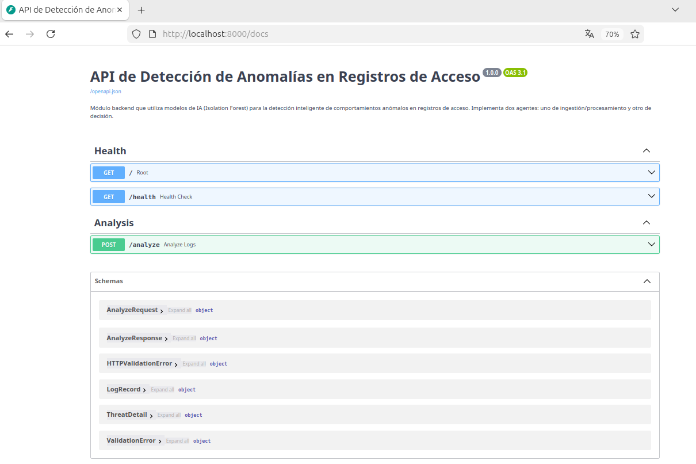
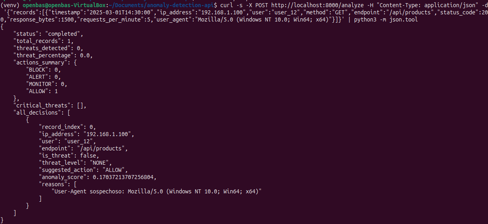
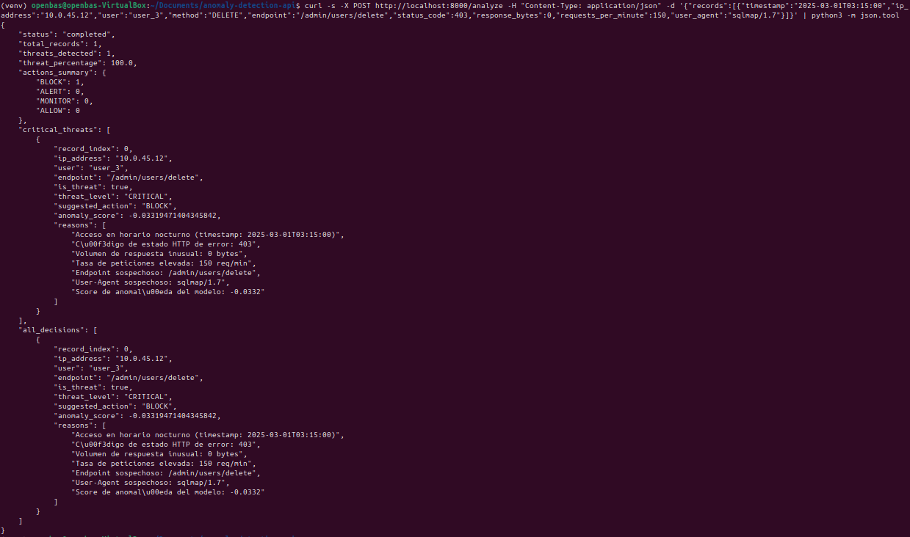
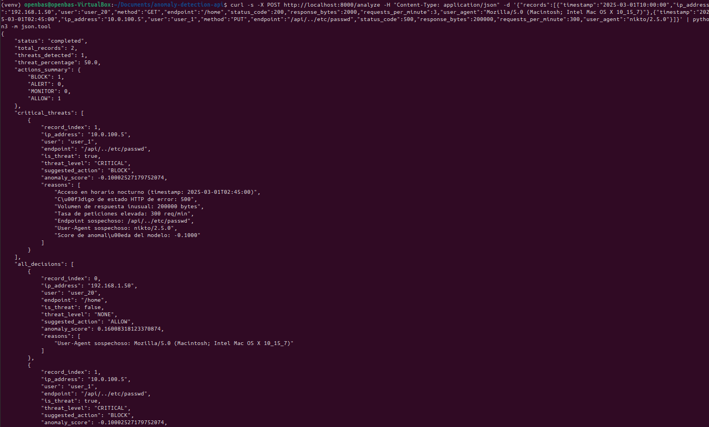

# 🛡️ API de Detección de Anomalías en Registros de Acceso

Módulo backend que utiliza modelos de IA (Isolation Forest) para la detección inteligente de comportamientos anómalos en registros de acceso. Implementa una arquitectura de **dos agentes** que se comunican internamente para procesar, analizar y sugerir acciones ante posibles amenazas.

---

## 📋 Tabla de Contenidos

- [Arquitectura](#-arquitectura)
- [Flujo de Agentes](#-flujo-de-agentes)
- [Tecnologías](#-tecnologías)
- [Instalación y Ejecución](#-instalación-y-ejecución)
- [Uso de la API](#-uso-de-la-api)
- [Dataset](#-dataset)
- [Modelo de IA](#-modelo-de-ia)
- [Tests](#-tests)
- [Estructura del Proyecto](#-estructura-del-proyecto)

---

## 🏗️ Arquitectura

```
┌─────────────────────────────────────────────────────────────────┐
│                        Cliente (curl/Postman)                   │
│                              │                                  │
│                    POST /analyze  {records}                     │
└──────────────────────────────┬──────────────────────────────────┘
                               │
                               ▼
┌─────────────────────────────────────────────────────────────────┐
│                     FastAPI REST Server                         │
│                      (app/main.py)                              │
│                                                                 │
│  ┌───────────────────────┐    ┌───────────────────────────┐    │
│  │  AGENTE 1: Ingestión  │───▶│  AGENTE 2: Decisión       │    │
│  │                       │    │                           │    │
│  │ • Validar registros   │    │ • Evaluar nivel amenaza   │    │
│  │ • Feature engineering │    │ • Determinar acción       │    │
│  │ • Ejecutar modelo ML  │    │ • Generar razones         │    │
│  │ • Calcular scores     │    │ • Resumen ejecutivo       │    │
│  └───────────┬───────────┘    └───────────┬───────────────┘    │
│              │                            │                     │
│              ▼                            ▼                     │
│  ┌───────────────────┐       ┌─────────────────────────┐       │
│  │  Isolation Forest │       │  Motor de Reglas         │       │
│  │  (scikit-learn)   │       │  BLOCK/ALERT/MONITOR/    │       │
│  │  + Feature Eng.   │       │  ALLOW                   │       │
│  └───────────────────┘       └─────────────────────────┘       │
└─────────────────────────────────────────────────────────────────┘
```

El sistema sigue una arquitectura de **pipeline de agentes**:

1. **FastAPI** recibe el lote de registros en `/analyze`
2. **Agente de Ingestión** procesa los registros, extrae features y ejecuta el modelo
3. Los resultados se **comunican internamente** al **Agente de Decisión**
4. El Agente de Decisión evalúa la severidad y sugiere acciones
5. La respuesta consolidada se retorna al cliente

---

## 🤖 Flujo de Agentes

### Agente 1: Ingestión/Procesamiento (`ingestion_agent.py`)

| Responsabilidad | Detalle |
|---|---|
| Validación | Recibe y valida registros con Pydantic |
| Feature Engineering | Extrae 10 features numéricas de cada registro |
| Modelo ML | Ejecuta Isolation Forest para obtener scores de anomalía |
| Comunicación | Retorna `IngestionResult` con score, predicción y flags |

**Features extraídas:**
- `hour` / `is_night` — Hora del acceso y flag nocturno (00:00-06:00)
- `method_encoded` — Método HTTP codificado
- `status_code` / `is_error_status` — Código HTTP y flag de error (≥400)
- `response_bytes` / `is_extreme_bytes` — Tamaño de respuesta y flag de extremos
- `requests_per_minute` / `is_high_rpm` — Tasa de peticiones y flag de alta frecuencia
- `suspicious_endpoint` — Detección de rutas admin/debug/config
- `suspicious_agent` — Detección de tools como sqlmap, nikto, curl

### Agente 2: Decisión (`decision_agent.py`)

| Responsabilidad | Detalle |
|---|---|
| Evaluación de amenaza | Combina anomaly_score + flags para determinar severidad |
| Niveles de amenaza | CRITICAL, HIGH, MEDIUM, LOW, NONE |
| Acciones sugeridas | BLOCK, ALERT, MONITOR, ALLOW |
| Explicabilidad | Genera razones legibles para cada decisión |

**Lógica de decisión:**

| Condición | Nivel | Acción |
|---|---|---|
| Score < -0.25 o ≥5 flags | CRITICAL | BLOCK |
| Score < -0.15 o ≥4 flags | HIGH | BLOCK |
| Score < -0.05 o ≥3 flags | MEDIUM | ALERT |
| Anomalía con pocos flags | LOW | MONITOR |
| Sin anomalía | NONE | ALLOW |

---

## 🛠️ Tecnologías

- **Python 3.11+**
- **FastAPI** — Framework web REST
- **scikit-learn** — Isolation Forest para detección de anomalías
- **pandas / numpy** — Procesamiento de datos
- **Pydantic** — Validación de datos
- **joblib** — Serialización de modelos
- **Docker** — Containerización

---

## 🚀 Instalación y Ejecución

### Opción 1: Docker (Recomendado)

```bash
# Clonar repositorio
git clone https://github.com/juanmlasso/anomaly-detection-api.git
cd anomaly-detection-api

# Construir y ejecutar
docker-compose up --build

# La API estará disponible en http://localhost:8000
```

### Opción 2: Ejecución local con requirements.txt

```bash
# Clonar repositorio
git clone https://github.com/juanmlasso/anomaly-detection-api.git
cd anomaly-detection-api

# Crear entorno virtual (recomendado)
python -m venv venv
source venv/bin/activate  # Linux/Mac
# venv\Scripts\activate   # Windows

# Instalar dependencias
pip install -r requirements.txt

# Paso 1: Generar dataset sintético
python -m app.generate_dataset

# Paso 2: Entrenar modelo
python -m app.train_model

# Paso 3: Ejecutar servidor
uvicorn app.main:app --host 0.0.0.0 --port 8000 --reload
```

### Verificar que funciona

```bash
# Health check
curl http://localhost:8000/health

# Documentación interactiva (Swagger)
# Abrir en navegador: http://localhost:8000/docs
```

---

## 📡 Uso de la API

### Endpoint: `POST /analyze`

Envía un lote de registros de acceso y recibe el análisis de amenazas.

#### Request

```bash
curl -X POST http://localhost:8000/analyze \
  -H "Content-Type: application/json" \
  -d '{
    "records": [
      {
        "timestamp": "2025-03-01T14:30:00",
        "ip_address": "192.168.1.100",
        "user": "user_12",
        "method": "GET",
        "endpoint": "/api/products",
        "status_code": 200,
        "response_bytes": 1500,
        "requests_per_minute": 5,
        "user_agent": "Mozilla/5.0 (Windows NT 10.0; Win64; x64)"
      },
      {
        "timestamp": "2025-03-01T03:15:00",
        "ip_address": "10.0.45.12",
        "user": "user_3",
        "method": "DELETE",
        "endpoint": "/admin/users/delete",
        "status_code": 403,
        "response_bytes": 0,
        "requests_per_minute": 150,
        "user_agent": "sqlmap/1.7"
      }
    ]
  }'
```

#### Response

```json
{
  "status": "completed",
  "total_records": 2,
  "threats_detected": 1,
  "threat_percentage": 50.0,
  "actions_summary": {
    "BLOCK": 1,
    "ALERT": 0,
    "MONITOR": 0,
    "ALLOW": 1
  },
  "critical_threats": [
    {
      "record_index": 1,
      "ip_address": "10.0.45.12",
      "user": "user_3",
      "endpoint": "/admin/users/delete",
      "is_threat": true,
      "threat_level": "CRITICAL",
      "suggested_action": "BLOCK",
      "anomaly_score": -0.3241,
      "reasons": [
        "Acceso en horario nocturno (timestamp: 2025-03-01T03:15:00)",
        "Código de estado HTTP de error: 403",
        "Volumen de respuesta inusual: 0 bytes",
        "Tasa de peticiones elevada: 150 req/min",
        "Endpoint sospechoso: /admin/users/delete",
        "User-Agent sospechoso: sqlmap/1.7",
        "Score de anomalía del modelo: -0.3241"
      ]
    }
  ],
  "all_decisions": [
    {
      "record_index": 0,
      "ip_address": "192.168.1.100",
      "user": "user_12",
      "endpoint": "/api/products",
      "is_threat": false,
      "threat_level": "NONE",
      "suggested_action": "ALLOW",
      "anomaly_score": 0.1234,
      "reasons": ["Tráfico dentro de parámetros normales"]
    },
    { "..." : "..." }
  ]
}
```

### Otros Endpoints

| Método | Ruta | Descripción |
|---|---|---|
| GET | `/` | Estado del servicio |
| GET | `/health` | Health check de agentes |
| GET | `/docs` | Documentación Swagger UI |
| GET | `/redoc` | Documentación ReDoc |
| POST | `/analyze` | Análisis de registros |

---

## 📸 Aplicación en Funcionamiento

### Swagger UI


### Respuesta - Tráfico normal (ALLOW)


### Respuesta - Tráfico anómalo (BLOCK)


### Respuesta - Lote mixto


---

## 📊 Dataset

Se utiliza un **dataset sintético** generado por `app/generate_dataset.py` que simula registros de acceso web con las siguientes características:

- **2000 registros** totales
- **90% normales** (1800) — tráfico legítimo
- **10% anómalos** (200) — comportamientos sospechosos

**Campos del dataset:**

| Campo | Descripción | Normal | Anómalo |
|---|---|---|---|
| `timestamp` | Fecha/hora | Horario laboral (7-22h) | Madrugada (0-5h) |
| `ip_address` | IP del cliente | Red 192.168.1.x | Red 10.0.x.x |
| `user` | Usuario | 50 usuarios diversos | Concentrado en 10 usuarios |
| `method` | Método HTTP | GET, POST | DELETE, PUT, PATCH |
| `endpoint` | Ruta accedida | /api/products, /home | /admin/config, /etc/passwd |
| `status_code` | Código HTTP | 200, 201, 301 | 401, 403, 500 |
| `response_bytes` | Tamaño respuesta | 200-5000 bytes | 0-50 o 50K-500K bytes |
| `requests_per_minute` | Tasa peticiones | 1-15 rpm | 50-500 rpm |
| `user_agent` | Navegador/tool | Navegadores reales | sqlmap, nikto, curl |

---

## 🧠 Modelo de IA

### Isolation Forest

Se utiliza **Isolation Forest** de scikit-learn, un algoritmo de detección de anomalías no supervisado basado en árboles de decisión aleatorios:

- **Principio**: Las anomalías son más fáciles de "aislar" que los datos normales
- **Entrenamiento**: No requiere datos etiquetados (no supervisado)
- **Output**: Score de anomalía (más negativo = más anómalo) y clasificación binaria

### Pipeline de entrenamiento

1. **Generación de features** — 10 características numéricas extraídas de cada registro
2. **Entrenamiento base** — Isolation Forest con 200 estimadores sobre todo el dataset
3. **Ajuste fino (opcional)** — Re-entrenamiento con 300 estimadores usando solo muestras normales del 10% etiquetado
4. **Selección del mejor modelo** — Comparación por F1-score, se guarda el mejor

### Resultados obtenidos

```
Modelo seleccionado: base (F1 anomalía: 0.97)

              precision    recall  f1-score   support
      Normal       1.00      1.00      1.00      1800
    Anomalía       0.97      0.97      0.97       200
    accuracy                           0.99      2000
```

---

## 🧪 Tests

```bash
# Ejecutar todos los tests
pytest tests/ -v

# Tests incluidos:
# - test_root: Verificar estado del servicio
# - test_health: Health check de agentes
# - test_analyze_normal_traffic: Tráfico legítimo
# - test_analyze_anomalous_traffic: Tráfico sospechoso
# - test_analyze_mixed_batch: Lote mixto
# - test_analyze_empty_records: Validación de request vacío
```

---

## 📁 Estructura del Proyecto

```
anomaly-detection-api/
├── app/
│   ├── __init__.py
│   ├── main.py                  # FastAPI app + endpoint /analyze
│   ├── generate_dataset.py      # Generador de dataset sintético
│   ├── train_model.py           # Pipeline de entrenamiento del modelo
│   └── agents/
│       ├── __init__.py
│       ├── ingestion_agent.py   # Agente 1: Procesamiento de registros
│       └── decision_agent.py    # Agente 2: Decisión y acciones
├── data/
│   └── access_logs.csv          # Dataset generado (2000 registros)
├── models/
│   ├── isolation_forest.joblib  # Modelo entrenado
│   └── feature_engineer.joblib  # Feature engineer serializado
├── tests/
│   └── test_api.py              # Tests de la API
├── Dockerfile
├── docker-compose.yml
├── requirements.txt
└── README.md
```

---

## 📝 Notas Adicionales

- La documentación interactiva de la API está disponible en `/docs` (Swagger UI) y `/redoc`
- El modelo se entrena una sola vez al inicio; los artefactos se persisten en `/models`
- Para usar un dataset real de Kaggle, reemplace `data/access_logs.csv` manteniendo las mismas columnas
- Los umbrales de decisión en `DecisionAgent` son configurables para ajustar sensibilidad
